# Fintrack — Finance Dashboard UI

A clean, interactive Finance Dashboard built with React + Vite for the Zorvyn Frontend Developer Intern screening assignment.

---

##  Getting Started

### Prerequisites
- Node.js v18+
- npm v9+

### Installation & Run

```bash
# 1. Install dependencies
npm install

# 2. Start development server
npm run dev

# 3. Open in browser
# http://localhost:5173
```

### Build for Production
```bash
npm run build
npm run preview
```

---

##  Project Structure

```
finance-dashboard/
├── index.html
├── vite.config.js
├── package.json
├── README.md
└── src/
    ├── main.jsx                        # App entry point
    ├── App.jsx                         # Root layout (sidebar + main)
    ├── App.module.css
    │
    ├── context/
    │   └── AppContext.jsx              # Global state (React Context)
    │
    ├── data/
    │   └── transactions.js             # Mock transaction data + constants
    │
    ├── utils/
    │   └── helpers.js                  # Pure helper functions
    │
    ├── styles/
    │   └── global.css                  # CSS variables + base styles
    │
    └── components/
        ├── shared/
        │   ├── Sidebar.jsx / .module.css
        │   ├── Modal.jsx  / .module.css
        │   ├── SparkLine.jsx
        │   ├── DonutChart.jsx / .module.css
        │   └── BarChart.jsx   / .module.css
        │
        ├── Dashboard/
        │   ├── Dashboard.jsx
        │   └── Dashboard.module.css
        │
        ├── Transactions/
        │   ├── Transactions.jsx
        │   └── Transactions.module.css
        │
        └── Insights/
            ├── Insights.jsx
            └── Insights.module.css
```

---

##  Features Implemented

### 1. Dashboard Overview
- Summary cards: Total Balance, Income, Expenses, Savings Rate
- Balance trend sparkline chart (SVG, no external library)
- Monthly comparison bar chart (Feb vs Mar)
- Spending breakdown donut chart
- Recent transactions table

### 2. Transactions Section
- Full table with Date, Description, Category, Amount, Type
- **Search** by description or category
- **Filter** by type (Income / Expense) and category
- **Sort** by Date, Description, or Amount (click column headers)

### 3. Role-Based UI (Frontend Simulated)
- **Admin**: Can add and delete transactions
- **Viewer**: Read-only — add/delete controls hidden
- Switch roles via the sidebar toggle (no login required)

### 4. Insights Section
- 6 KPI cards: top category, MoM comparison, savings, income change, savings rate, transaction count
- Category progress bars
- 5 auto-generated text observations derived from live data

### 5. State Management
- React Context (`AppContext`) for global state
- `useMemo` for all derived/computed values
- No external state library needed

### 6. UI / UX
- Dark fintech theme with CSS variables
- CSS Modules for scoped, maintainable styles
- Responsive grid layout
- Empty state handling on transactions table
- Form validation on Add Transaction modal

---

##  Tech Stack

| Tool | Purpose |
|------|---------|
| React 18 | UI framework |
| Vite | Build tool / dev server |
| React Context | State management |
| CSS Modules | Scoped component styles |
| Pure SVG | Charts (no chart library) |

---

##  Assumptions Made

- Data is scoped to March 2026 (current) and February 2026 (comparison)
- All amounts are in Indian Rupees (₹)
- Role switching is frontend-only simulation (no auth/backend)
- Charts are hand-drawn SVG for zero dependencies

---

*Built for Zorvyn FinTech Pvt. Ltd. — Frontend Developer Intern Assignment*

## Screenshots

### 🏠 Dashboard
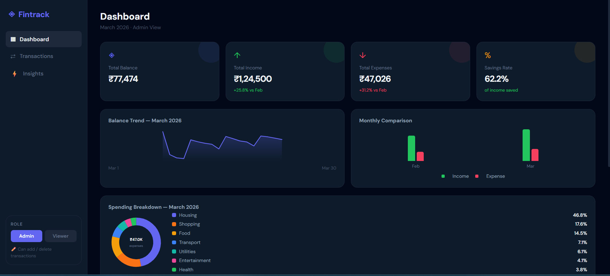
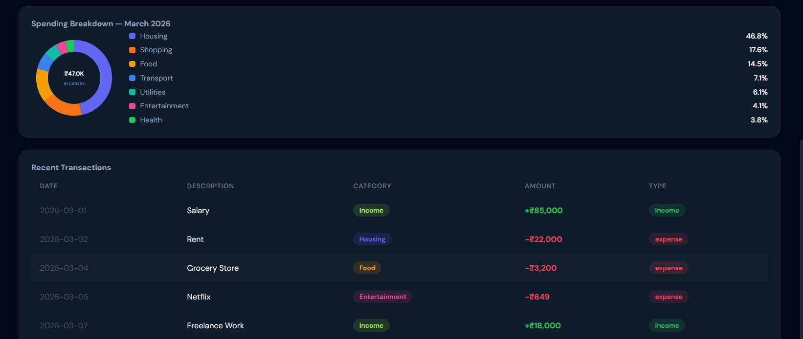

### ➕ Add Transaction
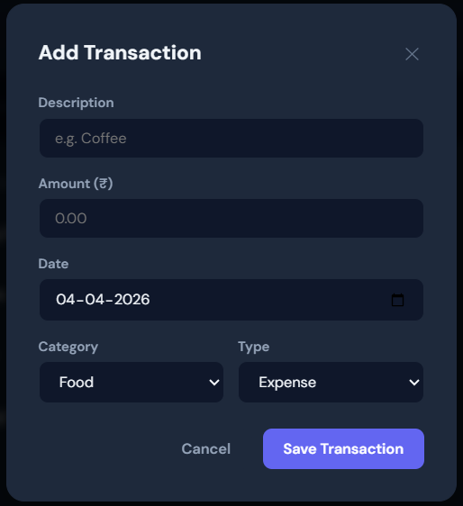
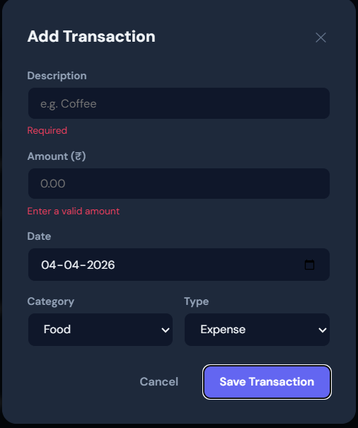

### 💳 Transactions
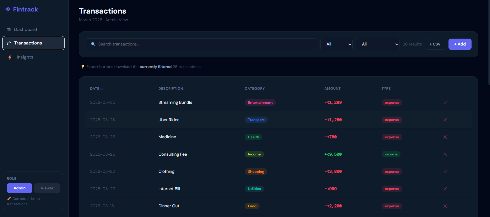
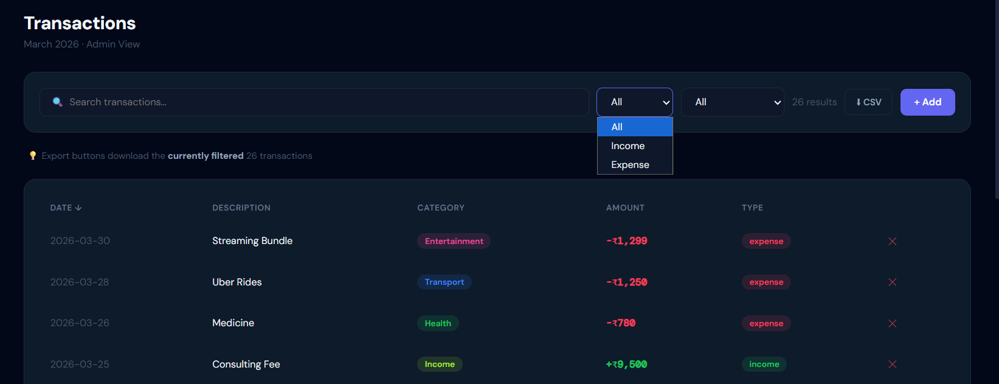
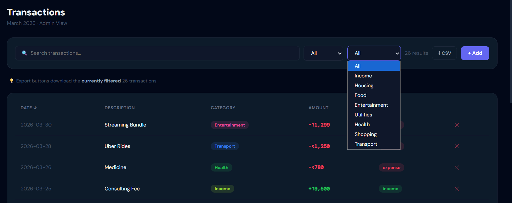

### 📊 Insights
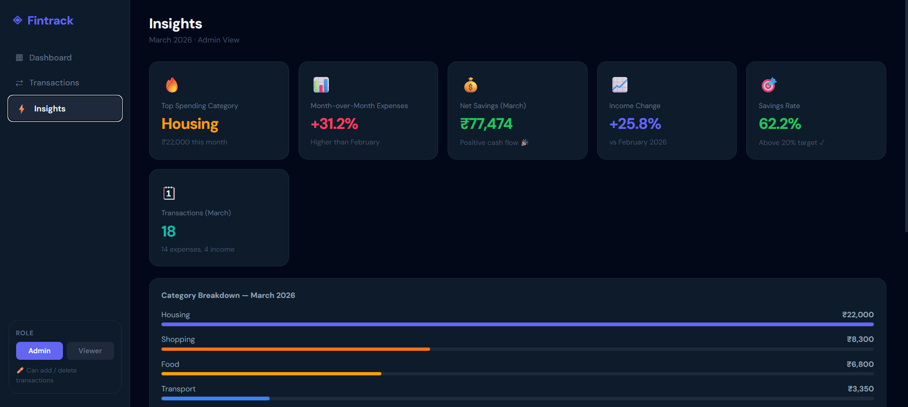
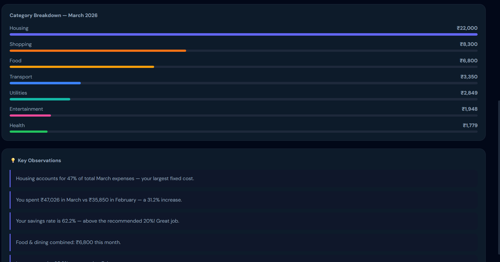

### 📱 Sidebar
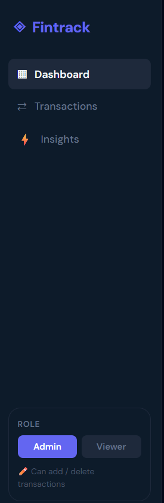
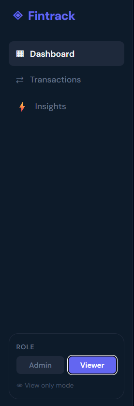

### 🖥️ Terminal / CMD
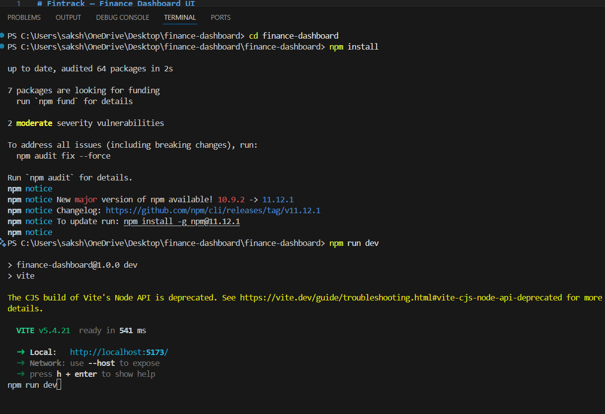